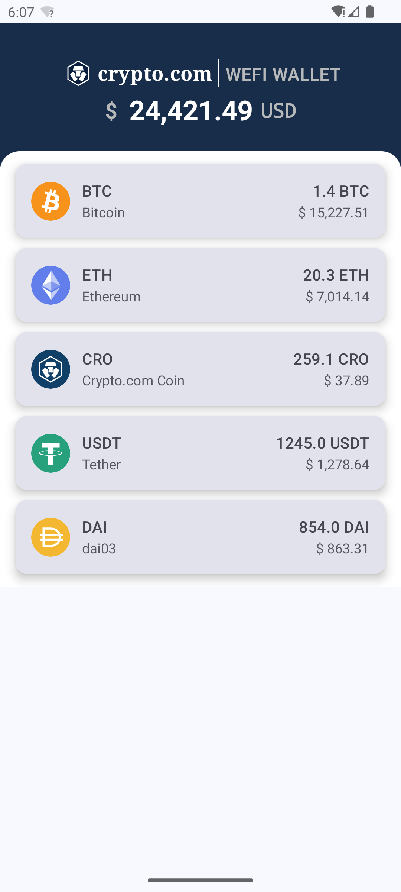

# CryptoWalletDemo
This is a demo about the crypto wallet.

# 项目结构

# 项目的基本想法
1. 首先使用MVVM设计客户端；
2. 使用JVM ktor application设计一个 <b>https//127.0.0.1:8443</b> 的本地服务器，提供https网络服务 + websockets服务（提供实时汇率更新效果，使用本地汇率波动模拟方法构建数据）；
3. 网络通行为跨进程通信，因此在客户端与服务器之间设计一个mock serveice, 分隔前后端API, 通过AIDL的Binder通信方式，实现跨进程(指定了不同的进程)数据交互；
4. 使用 kotlin compose\ viewmodel\ coutinescope\ ktor 等主流套件实现 UI/UX/数据构造与资源管理/网络通讯；
5. 使用openssl 生成密钥、证书；确保localhost运行在安全的网络请求中；
6. 尝试在ssl通讯过后，前后端分别生成用于数据加密的privateKey/ publicKey， 用于请求中的数据加密(生成了 并相互传输了公钥，TODO: 数据公钥加密，私钥解密);
7. TODO: 前置模块的思考，应该在Demo页面的前置部分，添加区块链/以太坊代币的 助记词填写页面，然后将助记词进行本地安全存储，通过本地助记词获取钱包地址，查询钱包余额；
8. TODO: 考虑创建钱包的能力；
9. TODO: 考虑web3j库的区块链以太坊交互、智能合约、交易管理等其他能力加入到本demo。

[]
